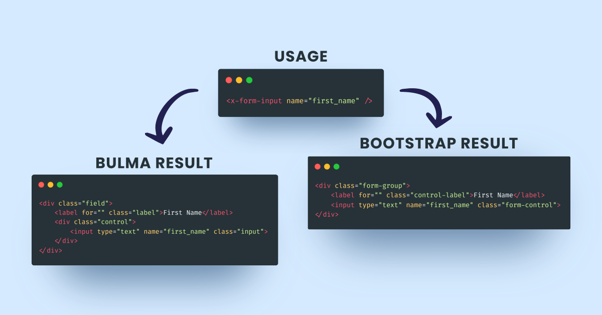

# Laravel 7 Form Component



This is a packages that provides form component supporting modern CSS Framework.
This work was inspired from [nafiesl/FormField](https://github.com/nafiesl/FormField)

## Installation
Install this package through [Composer](https://getcomposer.org/) by running command `composer require zhanang19/form-component`

## Configuration
- This package come with 2 form theme from [Bootstrap](https://getbootstrap.com) and [Bulma](https://bulma.io)
- You must publish config by running `php artisan vendor:publish --provider="Zhanang19\FormComponent\FormComponentServiceProvider --tag=config"` to setup form theme
- You can optionally publish views by running `php artisan vendor:publish --provider="Zhanang19\FormComponent\FormComponentServiceProvider --tag=config"`. This is useful when you want to add your own theme or customize default theme

## Usage
- Basic usage
    Type this on your blade view:
    ```html
    <x-form-input name="first_name" />
    ```
    Will generate:
    ```html
    <div class="form-group">
        <label for="" class="control-label">First Name</label>
        <input type="text" name="first_name" class="form-control">
    </div>
    ```

- Advanced usage
    
    This package automatically merge attributes into form input tag. We also provide some useful slot here. Check [Laravel Component Section](https://laravel.com/docs/7.x/blade) for more usage.

## Todo
- [ ] Add configuration
- [ ] Add unit test (see [#1](https://github.com/zhanang19/form-component/issues/1))
- [ ] Add form horizontal layouts in Bulma theme
- [ ] Add form group layouts in Bootstrap theme

## Credits
- [Zainal Hasan](https://github.com/zhanang19)
- [Meyta Tan](https://dribbble.com/myta1981)
- [All Contributors](../../contributors)

## Support
- [Buy me a coffee](https://www.buymeacoffee.com/zhanang19)

## License
The MIT License (MIT). Please see [License File](LICENSE) for more information.
